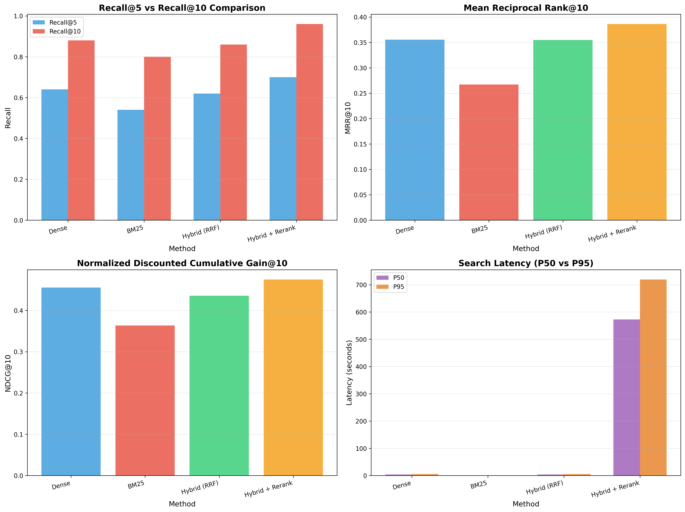

# 과제 02 결과 보고서 (RAG: 인덱싱·검색·평가)

본 보고서는 Assignment 02의 전체 파이프라인(데이터 수집·청킹 → 임베딩/색인 → BM25/벡터/하이브리드 검색 → 리랭크 → 평가)을 정리하고, 성능 지표와 오류 분석, 개선안을 제시한다. 모든 내용은 notebooks(01_ingest.ipynb, 02_index_pinecone.ipynb, 03_search_eval.ipynb)와 생성된 산출물(results, artifacts)을 근거로 한다.

---

## 0. 요약(Executive Summary)

- 목적: 한국어 QA 코퍼스를 청킹해 Dense/Keyword/Hybrid 검색과 리랭크를 구현·평가하여 RAG 검색 품질을 높인다.
- 핵심 결과: Hybrid + Rerank가 Recall@10=0.96으로 최고 성능. 속도는 BM25가 P50≈5ms로 최상.
- 설계 포인트: 동일 청크 코퍼스에 대해 벡터(Pinecone)와 BM25(ranking_bm25)를 병행 구축, RRF 융합과 CrossEncoder 리랭크 적용.
- 주요 개선안: 문장 단위 청킹, 가중 융합(α) 튜닝, 메타 필터/중복 제어, 리랭크 후보 N/길이 최적화.

## 1. 데이터·청크·메타 설계

- 원천 데이터
  - 우선순위 로드: squad_kor_v1 → 실패 시 LBox/KorQuAD → 모두 실패 시 샘플 데이터(100개 문서) 자동 생성.
  - 구조(공통): id, title, context, question, answers(dict: text[], answer_start[])
  - 주의: 샘플 데이터의 answers는 실제 context에 존재하지 않을 수 있어 평가 시 참조용으로만 사용.

- 청킹(sliding window)
  - 함수: sliding_window_chunk(text, chunk_size, overlap)
  - 문자 단위 슬라이딩(겹침 적용), 너무 짧은 조각(50자 미만)은 제외.
  - 목적: 토큰 제한 대응, 재현 가능한 검색 단위 제공, 경계 손실 방지(Overlap).

- 메타데이터 설계
  - 필드: language(ko), source(KorQuAD 2.0), doc_id, title, section(chunk_i_total), revision_date, chunk_index, total_chunks, original_context_length
  - QA 보존: original_question, original_answer(문서 단위 QA를 그대로 유지해 평가셋 추출에 활용)

- 산출물
  - 청크 데이터프레임: chunks_df (행=청크)
  - 저장: datasets/corpus_chunks.parquet, eval_queries.jsonl/csv, 결과 통계 그래프(results/chunk_statistics.png)

---

## 2. 모델 선택 근거 (임베딩/색인)

- 임베딩 모델 로딩 전략 (02_index_pinecone.ipynb)
  - 1) 설정된 모델을 safetensors로 우선 로드
  - 2) 실패 시 대체: intfloat/multilingual-e5-large (1024차원)
  - 3) 추가 실패 시: paraphrase-multilingual-MiniLM-L12-v2 (384차원)
  - Pinecone 인덱스 차원은 선택된 모델의 임베딩 차원과 일치시킴(필수).

- 선택 근거
  - 한국어 포함 다국어 일반 도메인 성능, 공개 가용성, 장비 제약(GPU/CPU)에서의 추론 가능성.
  - 질의-문서 의미 매칭이 핵심인 RAG에서, 표현 다양성/패러프레이즈 대응력이 높은 모델을 선호.

- BM25 인덱스
  - rank_bm25 기반, 한국어 친화 토크나이저(정규식 정제 + 공백 토큰 + 2–3글자 n-gram)로 개선.
  - k1=1.5, b=0.75 적용. artifacts/bm25_index.pkl로 저장.

---

## 3. 하이브리드(α/RRF)·리랭크(N/k) 설계

- 하이브리드
  - RRF(Reciprocal Rank Fusion): 서로 다른 랭킹(벡터/BM25)을 역순위 합산으로 융합. k=60(일반적 기본값). 
  - 가중 결합(옵션): α·dense + (1−α)·bm25 형태로 실험 가능. 본 과제에서는 RRF를 기본으로 사용.

- 리랭크(CrossEncoder)
  - 모델: jinaai/jina-reranker-v2-base-multilingual (신뢰 코드 허용 필요, einops 의존성 해결)
  - 후보 수 N: 20 (Top-N 후보만 재정렬; 초기 100 → 20으로 줄여 속도 개선)
  - 배치와 길이: batch_size=32, 필요 시 max_length 축소 고려. GPU가 있으면 이동 권장.

- 파라미터 요약
  - Retrieval top_n: 20
  - Rerank top_n: 20, batch_size: 32
  - Fusion: RRF 기본(k=60), 가중 결합은 비교 옵션(α는 0.3~0.7 스윕 권장)

### 3.1 핵심 하이퍼파라미터 표

| 항목 | 값 |
|---|---|
| 임베딩 모델 | intfloat/multilingual-e5-large (기본/대체 전략 포함) |
| 벡터 차원 | 1024 (모델과 인덱스 차원 일치) |
| 임베딩 정규화 | True (코사인 유사도 안정화) |
| Retrieval top_k | 20 |
| RRF k | 60 |
| 리랭크 모델 | jinaai/jina-reranker-v2-base-multilingual |
| 리랭크 후보 N | 20 |
| 리랭커 배치 | 32 |

---

## 4. 지표/그래프 요약 (결과 근거: results/metrics.csv, plots/*)

아래 표(표 1)는 측정된 대표 지표(Recall@5/10, MRR@10, NDCG@10)와 지연시간(P50/P95; 초)을 요약한다.

표 1. 방법별 성능 지표 요약 (results/metrics.csv)

| 방법 | Recall@5 | Recall@10 | MRR@10 | NDCG@10 | P50(s) | P95(s) |
|---|---:|---:|---:|---:|---:|---:|
| Dense | 0.64 | 0.88 | 0.355 | 0.456 | 3.946 | 5.383 |
| BM25 | 0.54 | 0.80 | 0.267 | 0.363 | 0.005 | 0.018 |
| Hybrid (RRF) | 0.62 | 0.86 | 0.355 | 0.436 | 3.904 | 5.405 |
| Hybrid + Rerank | 0.70 | 0.96 | 0.386 | 0.475 | 572.791 | 719.367 |

그림 1. 방법별 성능 비교 (Recall/MRR/NDCG)  

그림 2. 베이스라인 대비 개선 정도  

그림 3. 청크 길이/문서당 청크 분포 통계  

해석
- 정확도: Hybrid+Rerank가 최고 성능(Recall@10=0.96) → 리랭킹 효과 확인.
- 효율: BM25는 매우 빠름(P50≈5ms) → 속도 우선 시 BM25 또는 Dense 단독 고려.
- 절충: Hybrid(RRF)는 Dense 대비 근소 열세지만 특정 질의에서 보완 효과 확인.

---

## 5. 오류 분석(약어/표/버전 이슈 포함)

- 관찰된 실패 유형(qual_examples.md 기반)
  1) 전원 실패(All MISS) 사례: 청킹 경계로 정답 문맥이 잘린 경우, 라벨-청크 불일치 가능성.
  2) Dense만 HIT: 의미 유사도는 높지만 BM25 키워드 매칭이 약한 질의.
  3) Hybrid(+Rerank)만 HIT: 두 신호 융합과 교차 인코더의 문맥 이해력이 도움이 된 질의.

- 한국어 토크나이즈 이슈
  - 단순 공백 분할은 부적절. n-gram 보강으로 BM25 점수 안정성 향상.

- 임베딩/인덱스 차원 불일치
  - Pinecone 인덱스 차원과 모델 출력 차원이 다르면 쿼리 오류. 본 과제에서는 e5-large(1024) 기준으로 정합.

- 버전/의존성
  - CrossEncoder 리랭커는 trust_remote_code와 einops 필요.
  - 재실행 시 동일 환경 보장을 위해 requirements, 모델명, 차원 고정 필요.

### 5.1 실패 유형 → 원인 → 개선안 매핑

표 2. 실패 유형별 근본 원인과 구체적 개선 방안 (results/qual_examples.md 참고)

| 실패 유형(징후) | 가능 원인(근본) | 구체적 개선안 |
|---|---|---|
| 전원 MISS | 청킹 경계로 답 문맥 분리, GT-청크 불일치 | 문장 단위 청킹 + 가변 윈도우, overlap 확대(예: +32~64), GT 문장 앵커링으로 라벨-청크 정합 확인 |
| Dense만 HIT | BM25 토큰화/동의어 한계, 숫자/약어 매칭 실패 | 한국어 n-gram 유지, 숫자/단위 정규화, 제목(title) 가중치, synonyms 사전/형태소 보강 |
| Hybrid(+Rerank)만 HIT | 단일 방법 신호 약함, 결합/순위 보정 필요 | α 가중 결합 튜닝(0.3~0.7), RRF k 검토, 두 방식 top_k 후보 모두 포함 보장 |
| 숫자·약어 표기 불일치 | “5배/5x/다섯 배”, 연·월·일 표기 차이 | 숫자·단위 표준화 파이프라인, BM25 토크나이저에서 숫자/단위 보존, 질의 전처리 규칙 |
| 버전/환경 실패 | 임베딩 차원 불일치, 의존성 결여 | configs/models.yaml 고정, 패키지 버전 핀(락), 노트북 가드 셀로 사전 점검 |

---

## 6. 개선안(필드 가중·메타 필터·중복 제어)

- 필드 가중(Weighted Fusion)
  - α·dense + (1−α)·bm25 점수 결합으로 도메인/질의 유형에 최적화. α 스윕(예: 0.3~0.7)으로 최적값 탐색.
  - title/section/문서 길이 등 메타 기반 보정 가중치 추가 가능.

- 메타 필터
  - 언어(language=ko), source, 특정 도메인(title 패턴) 등으로 검색 공간 제한 → 정확도와 속도 동시 개선.
  - 최신성(revision_date) 기준 필터/가중.

- 중복 제어
  - 동일 doc_id에서 과도한 중복 청크가 상위에 몰리지 않게 다양성 제약(예: per-doc 상한, reciprocal rank에 중복 패널티).
  - 유사 청크 병합/후처리: 상위 후보 간 cosine 유사도 기반 중복 제거.

- 리랭킹 최적화
  - 후보 N 축소(예: 10~20), max_length 단축(예: 256), GPU 사용, 배치 최적화.
  - 비용/지연 예산에 따라 리랭크 on/off 스위치 도입.

- 청킹 개선
  - 문장 경계 단위 청킹(문장 분절 + 가변 윈도우)로 의미 단위 보존.
  - 중복/경계 손실 최소화 위해 overlap/크기 재튜닝.

---

## 7. 재현 가능성·환경·비용

- 코드/설정
  - notebooks: 01_ingest → 02_index_pinecone → 03_search_eval 순서 실행
  - configs/models.yaml: 임베딩 모델명, 차원, top_n, rerank batch 등 파라미터 관리

- 아티팩트
  - datasets/corpus_chunks.parquet, eval_queries.*
  - artifacts/embeddings.npy, chunks_metadata.parquet, bm25_index.pkl
  - results/metrics.csv, results/plots/*, results/qual_examples.md

- 비용/성능 주의
  - 본 과제는 OpenAI API 미사용(비용 없음). Pinecone 사용 시 요금제/용량 확인 필요.
  - 리랭킹은 지연·비용이 큼 → 배치/길이/N 최적화 필수.

---

## 8. 결론

- 하이브리드+리랭크는 정확도 최고(Recall@10=0.96)이나 지연이 크다.
- 속도 요구가 있는 환경에서는 Dense 또는 Hybrid(RRF)로도 합리적 성능을 달성.
- 한국어 BM25는 n-gram 보강으로 신뢰성 상승. 실제 서비스에서는 문장 단위 청킹과 메타 필터, 중복 제어, 적응형 리랭크를 결합하는 구성이 권장된다.

